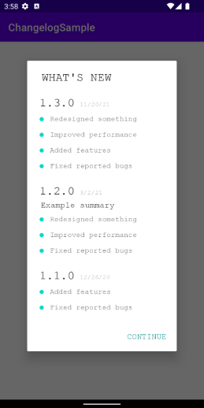

# Changelog


[](https://jitpack.io/#am3n/Changelog)

Changelog is a library for Android API 21+. 
It helps developers display the history of changes in their applications.

You can find a sample code of Changelog in this repository.

Screenshots
-------



Installation
-------
```groovy
repositories {
    maven { url "https://jitpack.io" }
}
```
```groovy
dependencies {
    implementation "com.github.am3n:Changelog:NEWEST-VERSION"
}
```


Usage
-------

###
Add log history as xml sources to `/res/xml`
```xml
<changelog>

    <release version="1.2.0" versioncode="61" summary="Example summary" date="2021-3-2">
        <change>Redesigned something</change>
        <change>Improved performance</change>
        <change>Fixed reported bugs</change>
    </release>

    <release version="1.1.0" versioncode="44" date="2020-12-26">
        <change>Added features</change>
        <change>Fixed reported bugs</change>
    </release>

</changelog>
```

###
The `present` function is used to show change log list.
```kotlin
Changelog.present(
    activity = this,
    presentMode = PresentMode.IF_NEEDED,
    presentFrom = Changelog.NEW_VERSIONS,
    ignoreAlphaBeta = false,
    title = getString(R.string.whats_new),
    buttonText = "Ok!",
    changelogId = R.xml.changelog,
    layoutDirection = LayoutDirection.RTL,
    onDismissOrIgnoredListener = {
        Toast.makeText(this, "onDismissOrIgnored", Toast.LENGTH_SHORT).show()
    }
)
```

###
If use `layoutDirection` should add this your project 
& handle Rtl supporting in your app by yourself.
```xml
<application
    android:supportsRtl="false">
</application>
```
Of course, to support layout direction by yourself 
you can use A3 views in my library: https://github.com/am3n/NeedTool

###
The `clear` is used to reset this library history.
```kotlin
Changelog.clear(applicationContext)
```


###
Upcoming
-------
* Add support locale languages
* Add custom typeface option
* Add background drawable or color option
* Add presentIn option to show as dialog or bottom sheet or ...
* Add custom animations option
* Add button text color option
* Add cell image custom resource option
* Add cell image custom tint option
* Add dark mode option
* Add some features from 'Credits' libraries


Contribution
-------
If you've found an error in the library or sample, please file an issue.
Patches are encouraged, and may be submitted by forking this project and submitting a pull request.


Credits
-------
* https://github.com/MFlisar/changelog
* https://github.com/furkanakdemir/noticeboard
* https://github.com/anderscheow/WhatsNew
* https://github.com/cketti/ckChangeLog


License
-------

    Copyright 2022 Amirhosein Barati

    Licensed under the Apache License, Version 2.0 (the "License");
    you may not use this file except in compliance with the License.
    You may obtain a copy of the License at

       http://www.apache.org/licenses/LICENSE-2.0

    Unless required by applicable law or agreed to in writing, software
    distributed under the License is distributed on an "AS IS" BASIS,
    WITHOUT WARRANTIES OR CONDITIONS OF ANY KIND, either express or implied.
    See the License for the specific language governing permissions and
    limitations under the License.