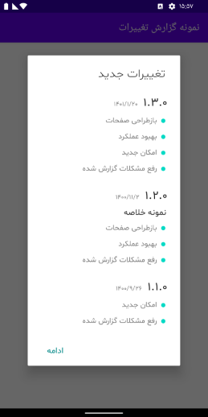
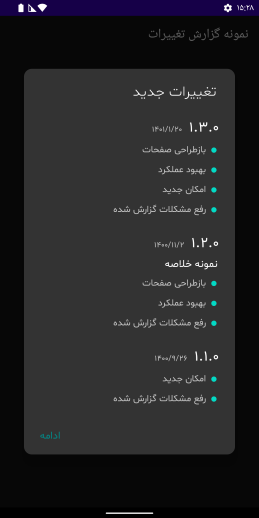
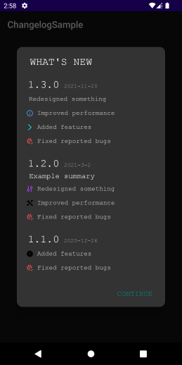

# Changelog


[](https://jitpack.io/#am3n/Changelog)

Changelog is a android library, it helps developers display the history of changes in their
applications.

Supports Locales, Layout directions, Dark-Mode & it's very customizable!

You can find a sample code of Changelog in this repository.


Screenshots
-------

|Ltr-English|Rtlized-Farsi|Default-BG & Dark-Mode|
|-----------|-------------|--------------------|
||||

|Customization-Icons|
|-------------------|
||

Installation
-------

```groovy
repositories {
    maven { url "https://jitpack.io" }
}
```

```groovy
dependencies {
    implementation "com.github.am3n:Changelog:NEWEST-VERSION"
}
```

Usage
-------

###

Add log history as xml sources to `/res/xml`

```xml
<changelog>

    <release version="1.3.0" versioncode="70" date="2021-11-20">
        <text>Redesigned something</text>
        <info>Improved performance</info>
        <custom>Added features</custom>
        <fix>Fixed reported bugs</fix>
    </release>

    <release version="1.2.0" versioncode="61" summary="Example summary" date="2021-3-2">
        <change>Redesigned something</change>
        <custom icon="R.drawable.ic_tools">Improved performance</custom>
        <fix>Fixed reported bugs</fix>
    </release>

    <release version="1.1.0" versioncode="44" date="2020-12-26">
        <new>Added features</new>
        <fix>Fixed reported bugs</fix>
    </release>

</changelog>
```

###

The `present` function is used to show change log list.

```kotlin
Changelog.present(
    activity = this,
    presentMode = PresentMode.IF_NEEDED,
    presentFrom = Changelog.NEW_VERSIONS,
    ignoreAlphaBeta = false,
    background = Changelog.DEFAULT_BACKGROUND, /* or custom Drawable */
    title = Holder(
        text = getString(R.string.whats_new),
        font = ResourcesCompat.getFont(applicationContext, R.font.font_thin)
    ),
    button = Holder(
        text = getString(R.string._continue),
        color = ContextCompat.getColor(applicationContext, R.color.teal_700)
    ),
    defaultFont = ResourcesCompat.getFont(applicationContext, R.font.font_regular),
    changelogId = R.xml.changelog,
    /* to use rtl supporting provided by Android, Use `android:supportsRtl="true"` instead of `layoutDirection` */
    //layoutDirection = LayoutDirection
    onDismissOrIgnoredListener = {
        Toast.makeText(this, "onDismissOrIgnored", Toast.LENGTH_SHORT).show()
    }
)
```

###

If use `layoutDirection` should add this your project & handle Rtl supporting in your app by
yourself.

```xml
<application
        android:supportsRtl="false">
</application>
```

Of course, to support layout direction by yourself you can use A3 views in my
library: https://github.com/am3n/NeedTool

###

The `clear` is used to reset this library history.

```kotlin
Changelog.clear(applicationContext)
```

###

Customization
-------------

- Can add change logs in other locales (e.g. `/res/xml-fa-rIR/`)

```xml
<changelog>

    <release version="۱.۳.۰" versioncode="70" date="1401/1/20">
        <text>بازطراحی صفحات</text>
        <info>بهبود عملکرد</info>
        <custom>امکان جدید</custom>
        <fix>رفع مشکلات گزارش شده</fix>
    </release>

    <release version="۱.۲.۰" versioncode="61" summary="نمونه خلاصه" date="1400/11/2">
        <change>بازطراحی صفحات</change>
        <custom icon="R.drawable.ic_tools">بهبود عملکرد</custom>
        <fix>رفع مشکلات گزارش شده</fix>
    </release>

    <release version="۱.۱.۰" versioncode="44" date="1400/9/26">
        <new>امکان جدید</new>
        <fix>رفع مشکلات گزارش شده</fix>
    </release>

</changelog>
```

###

- Can override the `new`, `change`, `info`, `fix` tag icons by creating your own custom icons with
  the same name as the drawables below:
    - new tag: `R.drawable.ic_changelog_item_new`
    - change tag: `R.drawable.ic_changelog_item_change`
    - info tag: `R.drawable.ic_changelog_item_info`
    - fix tag: `R.drawable.ic_changelog_item_fix`

###

- Can change default icon for all `custom` tags that has no `icon` attribute by
  overriding the `R.drawable.ic_changelog_item_custom_default`

```xml
<release>
    ...
    <custom>Added features</custom>
</release>
```

###

- Can override the `new`, `change`, `info`, `fix` tag icon default colors.
  (e.g. `/res/values/`, `/res/values-night/`)

```xml
<resources>
    ...
    <color name="colorChangelogItemNew">?</color>
    <color name="colorChangelogItemChange">?</color>
    <color name="colorChangelogItemInfo">?</color>
    <color name="colorChangelogItemFix">?</color>
    <color name="colorChangelogItemCustom">?</color>
</resources>
```

###

Upcoming
-------

* Add presentIn option to show as dialog or bottom sheet or ...
* Add custom animations option
* Add some features from 'Credits' libraries

Contribution
-------
If you've found an error in the library or sample, please file an issue. Patches are encouraged, and
may be submitted by forking this project and submitting a pull request.


Credits
-------

* https://github.com/MFlisar/changelog
* https://github.com/furkanakdemir/noticeboard
* https://github.com/anderscheow/WhatsNew
* https://github.com/cketti/ckChangeLog

License
-------

    Copyright 2022 Amirhosein Barati

    Licensed under the Apache License, Version 2.0 (the "License");
    you may not use this file except in compliance with the License.
    You may obtain a copy of the License at

       http://www.apache.org/licenses/LICENSE-2.0

    Unless required by applicable law or agreed to in writing, software
    distributed under the License is distributed on an "AS IS" BASIS,
    WITHOUT WARRANTIES OR CONDITIONS OF ANY KIND, either express or implied.
    See the License for the specific language governing permissions and
    limitations under the License.